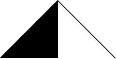

# Avalanche Machine Learning

A simple machine learning library built using pure Java. No third-party math or machine learning packages were used. It implements a variety of machine learning and deep learning algorithms, including neural nets, regression, clustering, q-learning, and others. It comes with some rudimentary matrix capabilities as well.

I have not updated this project in a couple of years. I've never taken a serious liking to Github, so I've only recently uploaded this old code.

Initially, this started as a small project for personal experimentation with AI, but as it grew, I started seriously considering publishing it as a Machine Learning package for Java. There aren't many satisfactory ones out there. It never reached that final goal, but it did become a wealth of implementations for common ML algorithms. Implementing it all was a great exercise for me.

## What can it DO?
* Linear Regression
    - Simple
    - Multiple
* Clustering
    - K-means
    - Hierarchical
* ML/DL (Neural Nets)
    - Convolutional Neural Nets
    - Dense/MLP/Artificial Neural Nets
    - Genetic Algoirthms
    - Q-Learning
* Matrix operations and other Math functions

## Installation
The complete package is under [/src/avalanche](/src/avalanche), so as long as you download that and move it into your porject, you should be able to use it like any other Java package.

## Documentation
Sorry. This project's documentation is certainly not up to par. However, using the source code and the tests that are included in the [/src](/src) directory, it should be relatively easy to figure out some functionality. Generally, the design is based on creating an instance of the algorithm that you want to use, and then fitting the data with it.

## License
This project is licensed under the MIT License. You can find more information in the [LICENSE.md](LICENSE.md) file.
